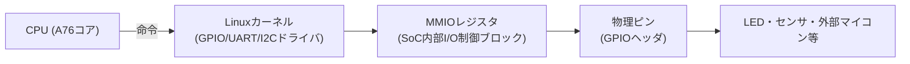
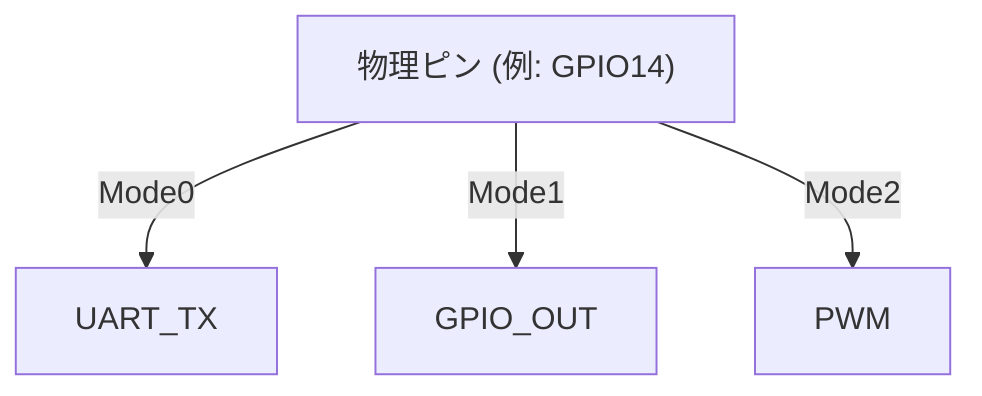
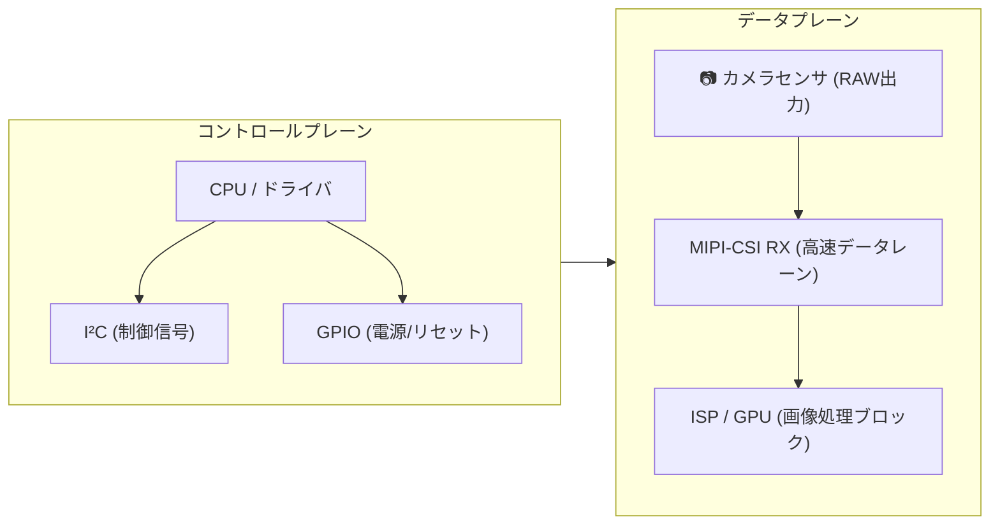
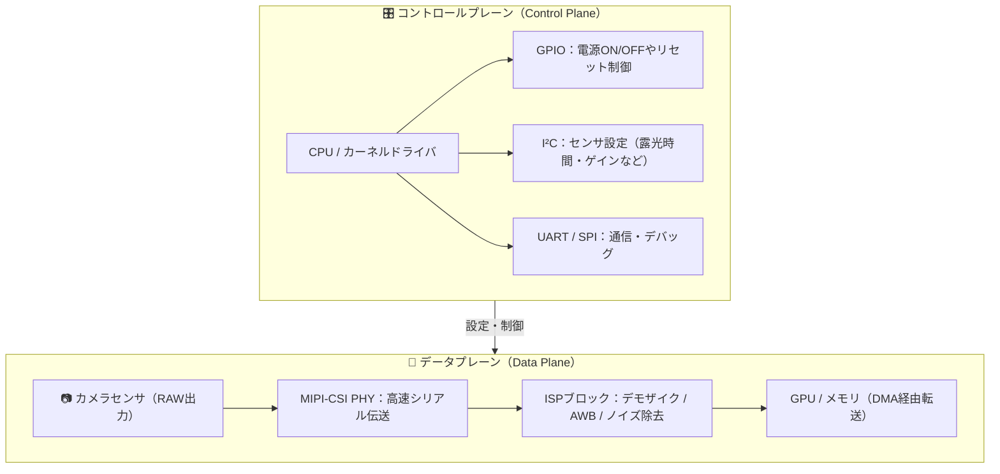

CPUは直接ピンを操作できません。

Linuxの **ドライバ（GPIOサブシステム）** がMMIO（Memory-Mapped I/O）経由でSoCのレジスタを書き換え、
その結果、物理ピンに電圧が出たり消えたりします。

Linuxでは、ハードウェアもファイルとして抽象化されています。
つまり /sys/class/gpio/gpio18/value に “1” を書くのは、
「このピンに高電圧（HIGH）を出せ」という指令です。

Raspberry PiのSoCピンは、1本の線が複数の機能を持ちます。  

