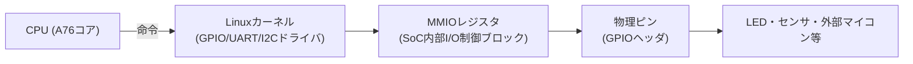

```mermaid
flowchart LR
    CPU["CPU (A76コア)"] -->|命令| Kernel["Linuxカーネル<br/>(GPIO/UART/I2Cドライバ)"]
    Kernel --> MMIO["MMIOレジスタ<br/>(SoC内部I/O制御ブロック)"]
    MMIO --> PAD["物理ピン<br/>(GPIOヘッダ)"]
    PAD --> DEVICE["LED・センサ・外部マイコン等"]
```
CPUは直接ピンを操作できません。

Linuxの **ドライバ（GPIOサブシステム）** がMMIO（Memory-Mapped I/O）経由でSoCのレジスタを書き換え、
その結果、物理ピンに電圧が出たり消えたりします。
