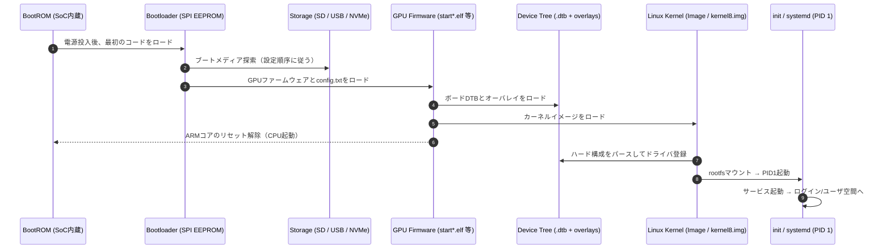
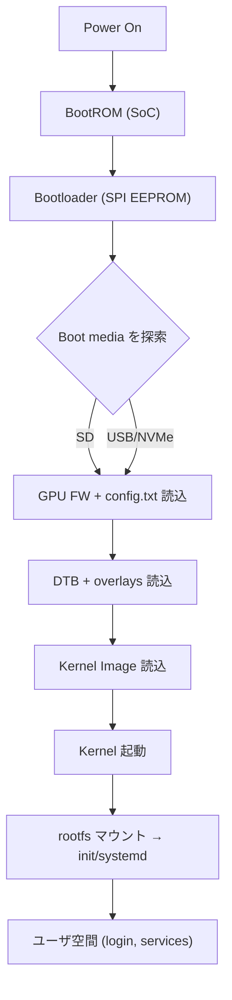

```mermaid
sequenceDiagram
autonumber
participant ROM as BootROM (SoC内蔵)
participant BL as Bootloader (SPI EEPROM)
participant ST as Storage (SD / USB / NVMe)
participant FW as GPU Firmware (start*.elf 等)
participant DTB as Device Tree (.dtb + overlays)
participant K as Linux Kernel (Image / kernel8.img)
participant INIT as init / systemd (PID 1)

ROM->>BL: 電源投入後、最初のコードをロード
BL->>ST: ブートメディア探索（設定順序に従う）
BL->>FW: GPUファームウェアとconfig.txtをロード
FW->>DTB: ボードDTBとオーバレイをロード
FW->>K: カーネルイメージをロード
FW-->>ROM: ARMコアのリセット解除（CPU起動）
K->>DTB: ハード構成をパースしてドライバ登録
K->>INIT: rootfsマウント → PID1起動
INIT->>INIT: サービス起動 → ログイン/ユーザ空間へ
```

```mermaid
flowchart TD
  A["Power On"] --> B["BootROM (SoC)"]
  B --> C["Bootloader (SPI EEPROM)"]
  C --> D{"Boot media を探索"}
  D -->|SD| E["GPU FW + config.txt 読込"]
  D -->|USB/NVMe| E
  E --> F["DTB + overlays 読込"]
  F --> G["Kernel Image 読込"]
  G --> H["Kernel 起動"]
  H --> I["rootfs マウント → init/systemd"]
  I --> J["ユーザ空間 (login, services)"]

```
