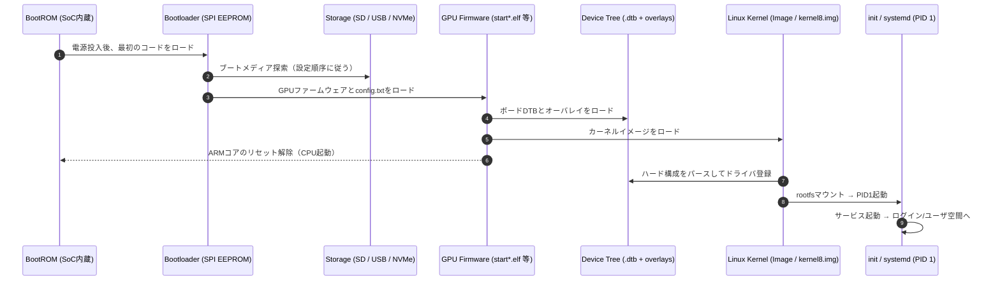
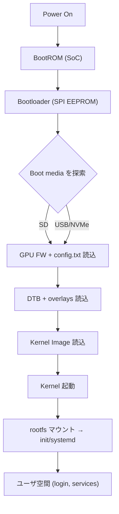
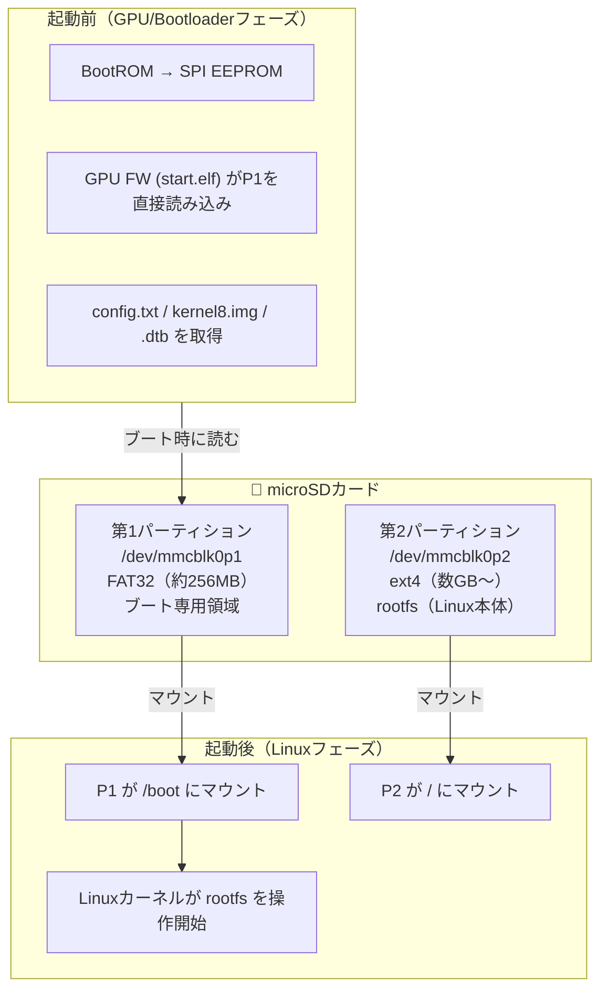
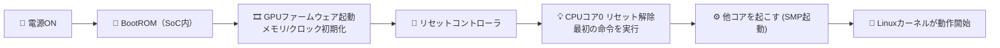

```mermaid
sequenceDiagram
autonumber
participant ROM as BootROM (SoC内蔵)
participant BL as Bootloader (SPI EEPROM)
participant ST as Storage (SD / USB / NVMe)
participant FW as GPU Firmware (start*.elf 等)
participant DTB as Device Tree (.dtb + overlays)
participant K as Linux Kernel (Image / kernel8.img)
participant INIT as init / systemd (PID 1)

ROM->>BL: 電源投入後、最初のコードをロード
BL->>ST: ブートメディア探索（設定順序に従う）
BL->>FW: GPUファームウェアとconfig.txtをロード
FW->>DTB: ボードDTBとオーバレイをロード
FW->>K: カーネルイメージをロード
FW-->>ROM: ARMコアのリセット解除（CPU起動）
K->>DTB: ハード構成をパースしてドライバ登録
K->>INIT: rootfsマウント → PID1起動
INIT->>INIT: サービス起動 → ログイン/ユーザ空間へ
```

```mermaid
flowchart TD
  A["Power On"] --> B["BootROM (SoC)"]
  B --> C["Bootloader (SPI EEPROM)"]
  C --> D{"Boot media を探索"}
  D -->|SD| E["GPU FW + config.txt 読込"]
  D -->|USB/NVMe| E
  E --> F["DTB + overlays 読込"]
  F --> G["Kernel Image 読込"]
  G --> H["Kernel 起動"]
  H --> I["rootfs マウント → init/systemd"]
  I --> J["ユーザ空間 (login, services)"]

```

```mermaid
flowchart TD
    subgraph SD["📀 microSDカード"]
        P1["第1パーティション<br/>/dev/mmcblk0p1<br/>FAT32（約256MB）<br/>ブート専用領域"]
        P2["第2パーティション<br/>/dev/mmcblk0p2<br/>ext4（数GB〜）<br/>rootfs（Linux本体）"]
    end

    subgraph FW["起動前（GPU/Bootloaderフェーズ）"]
        FW1["BootROM → SPI EEPROM"]
        FW2["GPU FW (start.elf) がP1を直接読み込み"]
        FW3["config.txt / kernel8.img / .dtb を取得"]
    end

    subgraph OS["起動後（Linuxフェーズ）"]
        OS1["P1 が /boot にマウント"]
        OS2["P2 が / にマウント"]
        OS3["Linuxカーネルが rootfs を操作開始"]
    end

    FW -->|ブート時に読む| P1
    P1 -->|マウント| OS1
    P2 -->|マウント| OS2
    OS1 --> OS3
```

```mermaid
flowchart LR
    Power["🔌 電源ON"] --> BootROM["🧩 BootROM（SoC内）"]
    BootROM --> GPU["🎞 GPUファームウェア起動<br/>メモリ/クロック初期化"]
    GPU --> ResetCtrl["🔁 リセットコントローラ"]
    ResetCtrl --> CPU0["💡 CPUコア0 リセット解除<br/>最初の命令を実行"]
    CPU0 --> CPU1["⚙️ 他コアを起こす (SMP起動)"]
    CPU1 --> Kernel["🐧 Linuxカーネルが動作開始"]
```
