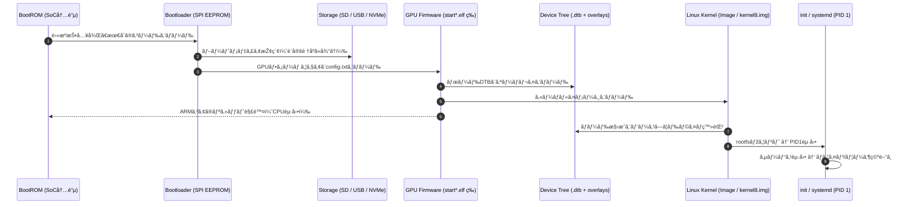
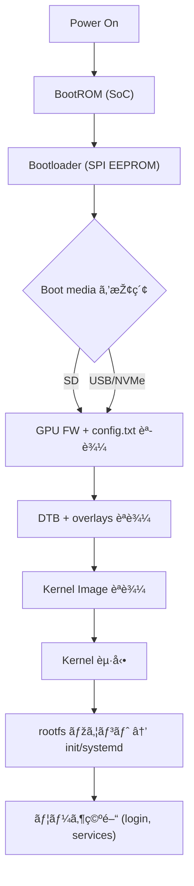
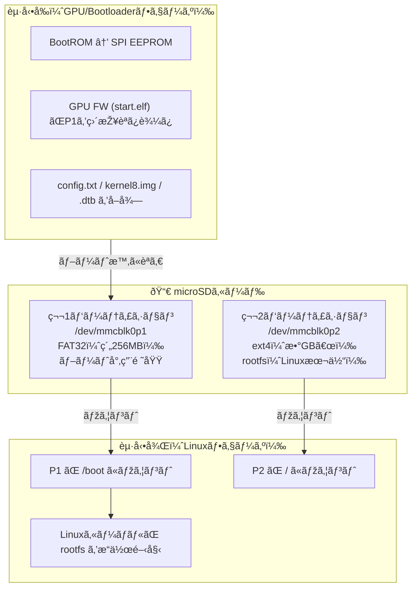

```mermaid
sequenceDiagram
autonumber
participant ROM as BootROM (SoC内蔵)
participant BL as Bootloader (SPI EEPROM)
participant ST as Storage (SD / USB / NVMe)
participant FW as GPU Firmware (start*.elf ç­‰)
participant DTB as Device Tree (.dtb + overlays)
participant K as Linux Kernel (Image / kernel8.img)
participant INIT as init / systemd (PID 1)

ROM->>BL: é›»æºæŠ•å…¥å¾Œã€æœ€åˆã®ã‚³ãƒ¼ãƒ‰ã‚’ロード
BL->>ST: ブートメディア探索（設定順åºã«å¾“ã†ï¼‰
BL->>FW: GPUファームウェアã¨config.txtをロード
FW->>DTB: ボードDTBã¨ã‚ªãƒ¼ãƒãƒ¬ã‚¤ã‚’ロード
FW->>K: カーãƒãƒ«ã‚¤ãƒ¡ãƒ¼ã‚¸ã‚’ロード
FW-->>ROM: ARMコアã®ãƒªã‚»ãƒƒãƒˆè§£é™¤ï¼ˆCPU起動）
K->>DTB: ãƒãƒ¼ãƒ‰æ§‹æˆã‚’パースã—ã¦ãƒ‰ãƒ©ã‚¤ãƒç™»éŒ²
K->>INIT: rootfsマウント → PID1起動
INIT->>INIT: サービス起動 → ログイン/ユーザ空間ã¸
```

```mermaid
flowchart TD
  A["Power On"] --> B["BootROM (SoC)"]
  B --> C["Bootloader (SPI EEPROM)"]
  C --> D{"Boot media を探索"}
  D -->|SD| E["GPU FW + config.txt 読込"]
  D -->|USB/NVMe| E
  E --> F["DTB + overlays 読込"]
  F --> G["Kernel Image 読込"]
  G --> H["Kernel èµ·å‹•"]
  H --> I["rootfs マウント → init/systemd"]
  I --> J["ユーザ空間 (login, services)"]

```

```mermaid
flowchart TD
    subgraph SD["📀 microSDカード"]
        P1["第1パーティション<br/>/dev/mmcblk0p1<br/>FAT32（約256MB）<br/>ブート専用領域"]
        P2["第2パーティション<br/>/dev/mmcblk0p2<br/>ext4（数GB〜）<br/>rootfs（Linux本体）"]
    end

    subgraph FW["èµ·å‹•å‰ï¼ˆGPU/Bootloaderフェーズ）"]
        FW1["BootROM → SPI EEPROM"]
        FW2["GPU FW (start.elf) ãŒP1を直接読ã¿è¾¼ã¿"]
        FW3["config.txt / kernel8.img / .dtb ã‚’å–å¾—"]
    end

    subgraph OS["起動後（Linuxフェーズ）"]
        OS1["P1 ㌠/boot ã«ãƒžã‚¦ãƒ³ãƒˆ"]
        OS2["P2 ㌠/ ã«ãƒžã‚¦ãƒ³ãƒˆ"]
        OS3["Linuxカーãƒãƒ«ãŒ rootfs ã‚’æ“作開始"]
    end

    FW -->|ブート時ã«èª­ã‚€| P1
    P1 -->|マウント| OS1
    P2 -->|マウント| OS2
    OS1 --> OS3
```
