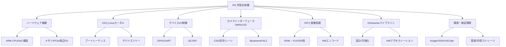

# Raspberry Pi 5 で学ぶ ARM・Linux・ISP テキストブック  
**Ver. 1.1 / Author: Kentarou Takaki**  
（実機トラック × 思考実験トラックの統合版）

---

## 目次
- 第0章：全体像と学習設計  
- 第1章：Raspberry Pi 5 のハードウェア全体像  
- 第2章：OSとLinuxカーネルの起動プロセス  
- 第3章：デバイスI/O（GPIO/UART/I²C）  
- 第4章：カメラインターフェース（MIPI/CSI → V4L2/libcamera）  
- 第5章：ISP（Image Signal Processor）理解とGStreamer  
- 第6章：開発・検証環境構築（ヘッドレス/冷却/記録）  
- 第7章：はじめてのカーネルモジュール（ドライバ入門）  
- 第8章：層で理解するSoC×OSの地図（統合復習）  
- 第9章：頭の中から実機へ（QEMU/U-Boot/Yocto/他SoC比較）  
- Appendix：推奨ハードウェア・参考コマンド集

---

## 🧭 第0章：全体像と学習設計

本書は Raspberry Pi 5 を題材に、**ARM SoC／Linux カーネル／Device Tree／MIPI/ISP／GStreamer** を段階的に学ぶ**実践×思考実験**ノートです。各章にチェックボックスがあり、**理解→実験→記録**のサイクルで進めます。

### 学習対象の全体構造（階層図）



## 📘 第1章：Raspberry Pi 5 のハードウェア全体像

**対象コンポーネント**：B（ハードウェア基礎）  
**レベル感**：  
- 理解：構造を**説明できる**  
- 実践：主要**ブロック図を自作**できる

**完了期待**  
- BCM2712 SoC（Cortex-A76×4, VideoCore VII, PCIe 他）と周辺の関係を説明できる  
- CSI/DSI/HDMI/USB/GPIOの役割と位置づけを整理できる

**実施チェックラン**  
- [x] Pi 5 の**ブロック図**を自作（CPU/GPU/ISP/DDR/PCIe/USB/CSI/DSI/HDMI/GPIO）  
- [x] **電源**（5V/5A）・**映像**（micro-HDMI 4K60×2）・**ストレージ**（microSD/PCIe-NVMe）を確認  
- [ ] NVMe HATやUSB3構成の**配線案**を描いた

**頭の中で動かす（思考実験）**  
```
[BCM2712 SoC]
├─ Cortex-A76 CPU × 4 (AArch64)
├─ GPU: VideoCore VII（ISP/メディアブロックと隣接）
├─ DDR Controller ── LPDDR
├─ I/O: PCIe / USB / GbE / HDMI x2 / CSI2 / DSI
└─ Low-speed: GPIO / I²C / SPI / UART
```
→ **問い**：CSIで入ったRAWが、どのブロックを経て表示/エンコードに至るかを線で結ぶ。

低速系に関しては以下を理解しておく。
| 種類                   | 役割                  | 帯域 | 用途                     | データの流れ            |
| -------------------- | ------------------- | -- | ---------------------- | ----------------- |
| **GPIO**             | ピンをON/OFFするだけの最小の制御 | 最低 | LED・リレー制御・単純センサ        | 1bitの状態（High/Low） |
| **I²C**              | 低速の制御バス（多デバイス）      | 低  | センサ設定、レジスタ読み書き         | シリアル、アドレスあり       |
| **SPI**              | 高速のストリーム制御バス        | 中  | ADC, DAC, ディスプレイ、フラッシュ | クロック同期ストリーム       |
| **UART**             | 非同期のテキスト通信          | 低  | マイコン、GPS、モデム           | バイト列（Tx/Rx）       |
| **MIPI CSI/DSI etc** | **超高速データプレーン**      | 高  | カメラ映像、ディスプレイ           | フレーム/画像データ        |


---

## 📗 第2章：OSとLinuxカーネルの起動プロセス

**対象**：C（OS/カーネル）  
**レベル感**：  
- 理解：ブートの**流れを説明**  
- 実践：Device Tree を**読んで対応関係を確認**

**完了期待**  
- BootROM → bootloader → firmware → kernel → init のシーケンスを説明  
- `/proc/device-tree`と`dmesg`から**実機構成を読み解く**

**実施チェックラン**  
- [x] ブートローダとカーネルの**役割**を説明  
- [x] `cat /proc/device-tree/model` を確認  
- [x] `dmesg`で**カメラ/ISP/PCIe**初期化ログを探索  
- [x] `/boot`, `/lib/modules`, `/proc` の**役割**を整理

**思考実験：想定コマンドと観察ポイント**
```bash
dmesg | less                 # デバイス初期化の時系列
ls /proc/device-tree         # ノードの構成
```
学び：**DTBが「ハード構成の真実源」**で、ドライバはこれを読み込んで登録される。

---

## 📙 第3章：デバイスI/Oと制御（GPIO/UART/I²C）

**対象**：D（I/O制御）  
**レベル感**：  
- 理解：GPIO/UART/I²C の**仕組み**  
- 実践：LED点灯・シリアル通信の**最小実験**

**完了期待**  
- GPIO入出力制御ができ、**ピン多重化（mux）**の重要性を理解  
- UART/I²C の信号・役割・典型配線を説明

**実施チェックラン**  
- [ ] Python/Cいずれかで**GPIO制御**を実施（LED点灯）  
- [ ] UARTで**ループバック**または外部機器と通信  
- [ ] `raspi-gpio get` でピン状態を確認  
- [ ] **MIPIピンとGPIOピン**の違いを整理

**思考実験：/sys 経由の制御モデル**
```bash
echo 18 > /sys/class/gpio/export
echo out > /sys/class/gpio/gpio18/direction
echo 1 > /sys/class/gpio/gpio18/value
```
学び：**「すべてはファイル」**。ユーザ空間I/Oはドライバ抽象を経てMMIOに到達。

---

## 📕 第4章：カメラインターフェース（MIPI/CSI → V4L2/libcamera）

**対象**：E（カメラインターフェース）  
**レベル感**：  
- 理解：CSI2 の**クロック＋データレーン**と帯域  
- 実践：**libcamera**でプレビュー／**v4l2-ctl**で列挙・取得

**完了期待**  
- **物理層（CSI2）**と**Linuxのメディア層（V4L2）**の切り分けを説明  
- `/dev/video*` とドライバの対応、**センサ( I²C )の役割**がわかる

**実施チェックラン**  
- [ ] カメラセンサの**レーン数/解像度/フレームレート**整理  
- [ ] `v4l2-ctl --list-devices` でノード確認  
- [ ] `libcamera-hello` などでプレビュー取得  
- [ ] **媒体グラフ**（センサ→CSI Rx→ISP→V4L2）を描画

**思考実験：想定コマンド**
```bash
v4l2-ctl --list-devices
v4l2-ctl -d /dev/video0 --stream-mmap --stream-count=60 --stream-to=frame.raw
```
学び：**I²C**はセンサ設定、**CSI2**は高速データ搬送、**V4L2**はユーザ空間の標準API。

---

## 📒 第5章：ISP理解とGStreamer

**対象**：F（ISP/画像処理）＆ G（GStreamer）  
**レベル感**：  
- 理解：RAW→デモザイク→NR→AWB→CCM→YUV→圧縮 の**処理鎖**  
- 実践：GStreamerで**プレビュー/エンコード**を通す

**完了期待**  
- Pi 5 の**ISPがメディアブロック側**で動く概念を理解  
- **HWエンコード（H.264/H.265）**をパイプラインで試行できる

**実施チェックラン**  
- [ ] **RAW vs YUV**の違い・用途を説明  
- [ ] `v4l2src → （変換） → kmssink` を実行  
- [ ] H.264/H.265 の**HWエンコード**テスト  
- [ ] 自作の**ISPパス図**を作成

**思考実験：最小パイプライン設計**
```bash
# 例：取得→表示（環境に応じて要素名は調整）
gst-launch-1.0 v4l2src ! videoconvert ! kmssink
# 例：取得→H.264保存
gst-launch-1.0 v4l2src ! videoconvert ! x264enc tune=zerolatency ! mp4mux ! filesink location=out.mp4
```
学び：**ゼロコピー/色空間/同期**などパイプライン設計の勘所を掴む。

---

## 📔 第6章：開発・検証環境構築（ヘッドレス/冷却/記録）

**対象**：H（開発・検証環境）  
**レベル感**：  
- 理解：**セットアップ全体**  
- 実践：**ヘッドレス開発**（SSH/VSCode）と**安定稼働**

**完了期待**  
- ImagerでOS書込み→Wi-Fi/SSH設定→起動の一連を自力で  
- ファン/ヒートシンク/電源/ストレージを**安定構成**に

**実施チェックラン**  
- [ ] ImagerでA2カード（V30/U3）にOSを書込み  
- [ ] ヘッドレス設定（`userconf`, `wpa_supplicant.conf`, SSH）  
- [ ] VSCode Remote SSH接続  
- [ ] `vcgencmd measure_temp` で温度監視  
- [ ] micro-HDMIで映像確認 / NVMe HAT構成の試走

**思考実験：運用の型**  
- 温度上昇時の**スロットリング**の挙動を`dmesg`で観察する絵を想像  
- SDとNVMeの**I/Oプロファイル差**をメモに取る（読み/書き/レイテンシ）

---

## 🧪 第7章：はじめてのカーネルモジュール（ドライバ入門）

**対象**：カーネル/ドライバの導入口  
**レベル感**：  
- 理解：**module_init/module_exit**とデバイスモデル  
- 実践：GPIOを点滅させる**最小モジュール**をビルド/挿入

**完了期待**  
- カーネルビルドツリーの**どこを見るか**がわかる  
- `insmod`/`rmmod`/`modinfo` の意味を説明できる

**実施チェックラン**  
- [ ] `make -C /lib/modules/$(uname -r)/build M=$(pwd) modules` でビルド  
- [ ] `sudo insmod`→動作→`sudo rmmod`  
- [ ] `dmesg`でモジュールログを確認  
- [ ] **GPLライセンス宣言**の意味を理解

**思考実験：骨格を読む**
```c
module_init(init_fn);
module_exit(exit_fn);
struct file_operations ...;     // ユーザ空間IF
struct platform_driver ...;     // OFマッチ/プローブ
```
学び：**OF(=Device Tree)とのマッチ→プローブ→レジスタ I/O**の流れが核。

---

## 🧩 第8章：層で理解する SoC × OS の地図（統合復習）

```
┌───────────────────────────┐
│ User Space (bash, Python, libcamera, gst) │
└────────────┬──────────────┘
             │ sysfs / ioctl / V4L2 / MMAP
┌────────────┴──────────────┐
│ Kernel (Drivers, V4L2, DRM/KMS, MM, VFS) │
└────────────┬──────────────┘
             │ MMIO / IRQ / DMA
┌────────────┴──────────────┐
│ ARM SoC (BCM2712 A76x4, VideoCore VII, CSI/ISP, I/O) │
└───────────────────────────┘
```

**完了チェック**  
- [ ] ユーザ空間API→カーネルサブシステム→ハードの**三層連携**を説明  
- [ ] **割り込み/DM A/メモリマップ**の関係を言語化

---

## 🚀 第9章：頭の中から実機へ（QEMU/U-Boot/Yocto/他SoC比較）

| 段階 | 内容 | ゴール |
|---|---|---|
| Step 1 | **QEMU**でAArch64最小Linuxを起動 | ブートの観察と構成の再現 |
| Step 2 | **U-Boot**ビルド＆起動ログ読解 | ブートローダの役割理解 |
| Step 3 | **Yocto Project**で最小ディストリ作成 | BSP構築の基礎 |
| Step 4 | **i.MX93 EVK / Jetson**比較 | ISP有無やメディアブロック差の把握 |

**思考実験の問い**  
- ISPを持たないSoC（例：i.MX93）では、RAW→YUVの**どこをソフト/外部ブロック**で補う？  
- Pi 5 の**HWエンコード**を使う/使わないで、GStreamer設計はどう変わる？

---

## 🧾 Appendix：推奨ハードウェア・参考コマンド集

### 推奨ハードウェアリスト
| 種別 | 推奨 | 備考 |
|---|---|---|
| 本体 | Raspberry Pi 5 (16GB) | 余裕あるメモリで学習しやすい |
| 電源 | USB-C 5V/5A（27W） | 安定動作に必須 |
| ストレージ | microSD A2/V30/U3（256GB+） | OS/ログ用 |
| 追加 | NVMe HAT (PCIe) | ビルド/録画I/O向上 |
| カメラ | Camera Module 3 | MIPI CSI2 |
| 冷却 | PWMファン＋ヒートシンク | スロットリング対策 |
| ケース | 金属/エアフロー型 | 放熱重視 |
| ケーブル | micro-HDMI→HDMI (4K60)×2 | デュアル出力 |

### よく使う観察コマンド
```bash
# ブートとデバイス
dmesg | less
ls /proc/device-tree
uname -a

# ピン/温度
raspi-gpio get
vcgencmd measure_temp

# カメラ/メディア
v4l2-ctl --list-devices
libcamera-hello
```

---

# 章ごとの進捗チェックひな型（コピペして使う）

```md
### ✅ 実施チェックラン（章X）
- [ ] 観察ログを保存（`logs/chX_YYYYMMDD.txt`）
- [ ] 自作図を `docs/chX_diagram_v1.drawio` に追加
- [ ] 次回の疑問点を Issue 登録（`issues/#chX`）
```

---

## 使い方メモ
- **実機トラック**：実際にPi 5で手を動かして記録  
- **思考実験トラック**：コマンドの**期待挙動**やデータフローを**頭で再生**し、図と文章で残す  
- GitHubでは、章ごとに**ログ/図/メモ/Issue
