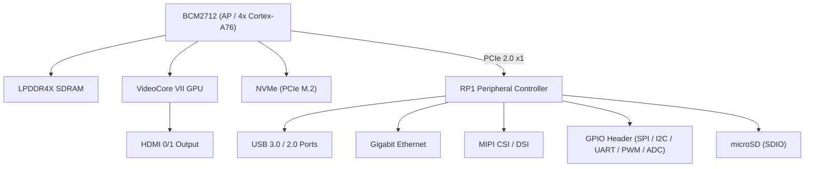
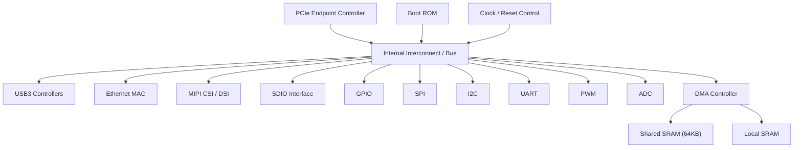
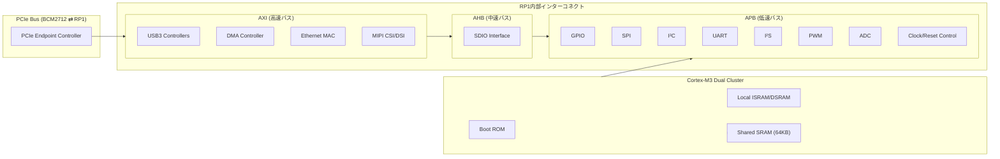
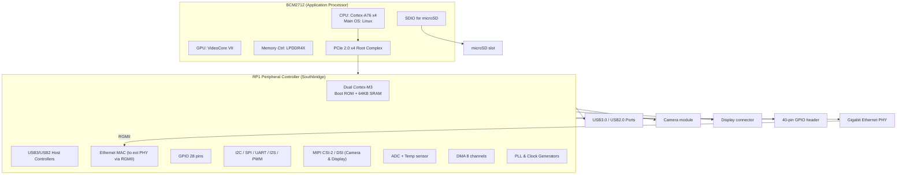

Toplevel

```mermaid
graph TD
    AP["BCM2712 (AP / 4x Cortex-A76)"]
    MEM["LPDDR4X SDRAM"]
    GPU["VideoCore VII GPU"]
    HDMI["HDMI 0/1 Output"]
    NVMe["NVMe (PCIe M.2)"]
    RP1["RP1 Peripheral Controller"]
    USB["USB 3.0 / 2.0 Ports"]
    ETH["Gigabit Ethernet"]
    MIPI["MIPI CSI / DSI"]
    GPIO["GPIO Header (SPI / I2C / UART / PWM / ADC)"]
    USD["microSD (SDIO)"]

    AP --> MEM
    AP --> GPU
    GPU --> HDMI
    AP --> NVMe
    AP -- "PCIe 2.0 x1" --> RP1
    RP1 --> USB
    RP1 --> ETH
    RP1 --> MIPI
    RP1 --> GPIO
    RP1 --> USD
```

RP1 Block Dig

```mermaid
graph TD
    PCIeEP["PCIe Endpoint Controller"]
    BUS["Internal Interconnect / Bus"]
    USB3["USB3 Controllers"]
    ETHMAC["Ethernet MAC"]
    MIPI2["MIPI CSI / DSI"]
    SDIO["SDIO Interface"]
    GPIO2["GPIO"]
    SPI2["SPI"]
    I2C2["I2C"]
    UART2["UART"]
    PWM2["PWM"]
    ADC2["ADC"]
    DMA["DMA Controller"]
    SSRAM["Shared SRAM (64KB)"]
    LSRAM["Local SRAM"]
    BOOT["Boot ROM"]
    CLK["Clock / Reset Control"]

    PCIeEP --> BUS
    BUS --> USB3
    BUS --> ETHMAC
    BUS --> MIPI2
    BUS --> SDIO
    BUS --> GPIO2
    BUS --> SPI2
    BUS --> I2C2
    BUS --> UART2
    BUS --> PWM2
    BUS --> ADC2
    BUS --> DMA
    DMA --> SSRAM
    DMA --> LSRAM
    BOOT --> BUS
    CLK --> BUS


```

```mermaid
flowchart LR
    subgraph PCIeBus["PCIe Bus (BCM2712 ⇄ RP1)"]
        PCIe_EP["PCIe Endpoint Controller"]
    end

    subgraph RP1_Interconnect["RP1内部インターコネクト"]
        direction TB
        subgraph AXI["AXI (高速バス)"]
            USB3["USB3 Controllers"]
            DMA["DMA Controller"]
            ETH["Ethernet MAC"]
            MIPI["MIPI CSI/DSI"]
        end
        subgraph AHB["AHB (中速バス)"]
            SDIO["SDIO Interface"]
        end
        subgraph APB["APB (低速バス)"]
            GPIO["GPIO"]
            SPI["SPI"]
            I2C["I²C"]
            UART["UART"]
            I2S["I²S"]
            PWM["PWM"]
            ADC["ADC"]
            CLKS["Clock/Reset Control"]
        end
    end

    subgraph CTRL["Cortex-M3 Dual Cluster"]
        ROM["Boot ROM"]
        ISRAM["Local ISRAM/DSRAM"]
        SHRAM["Shared SRAM (64KB)"]
    end

    PCIe_EP --> AXI
    AXI --> AHB
    AHB --> APB
    CTRL --> APB
    CTRL --> SHRAM
```

dig2

```mermaid
flowchart TB
  subgraph AP["BCM2712 (Application Processor)"]
    A76["CPU: Cortex-A76 x4\nMain OS: Linux"]
    GPU["GPU: VideoCore VII"]
    MEM["Memory Ctrl: LPDDR4X"]
    RC["PCIe 2.0 x4 Root Complex"]
    SDIO["SDIO for microSD"]
  end

  subgraph RP1["RP1 Peripheral Controller (Southbridge)"]
    M3["Dual Cortex-M3\nBoot ROM + 64KB SRAM"]
    USB["USB3/USB2 Host Controllers"]
    ETH["Ethernet MAC (to ext PHY via RGMII)"]
    GPIO["GPIO 28 pins"]
    LSIO["I2C / SPI / UART / I2S / PWM"]
    MIPI["MIPI CSI-2 / DSI (Camera & Display)"]
    ADC["ADC + Temp sensor"]
    DMA["DMA 8 channels"]
    PLL["PLL & Clock Generators"]
  end

  STORAGE["microSD slot"]
  PHY["Gigabit Ethernet PHY"]
  USBP["USB3.0 / USB2.0 Ports"]
  CAM["Camera module"]
  DISP["Display connector"]
  GPIOHDR["40-pin GPIO header"]

  %% Connections
  A76 --> RC
  RC --> RP1
  SDIO --> STORAGE
  RP1 --> USBP
  RP1 --> PHY
  RP1 --> GPIOHDR
  RP1 --> CAM
  RP1 --> DISP
  PHY -->|RGMII| ETH
```
