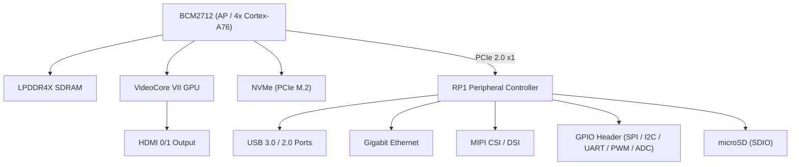
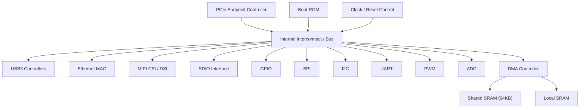
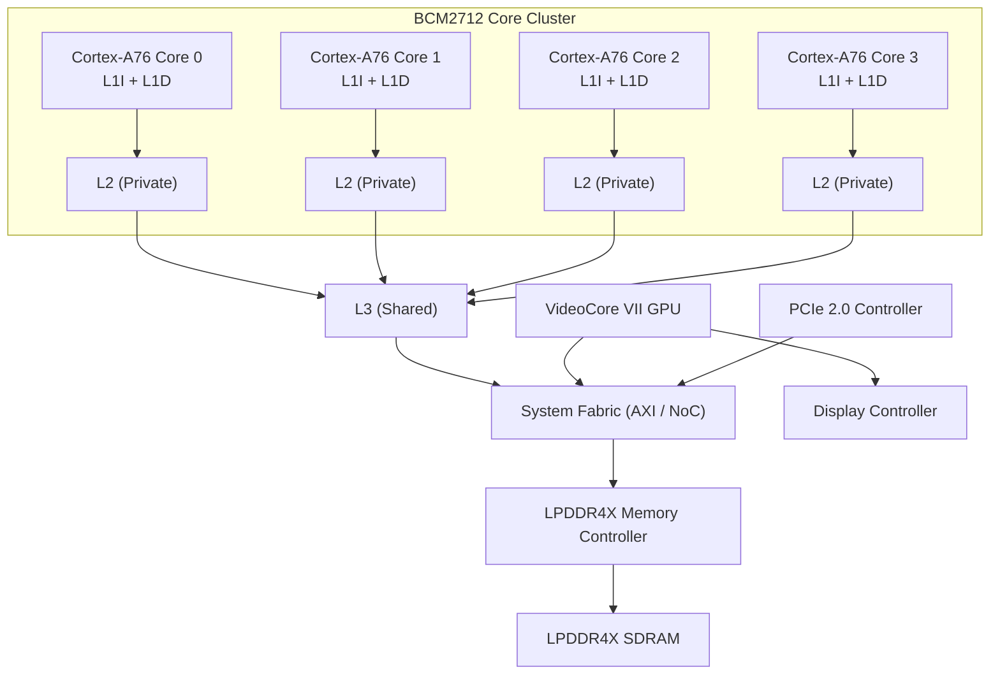
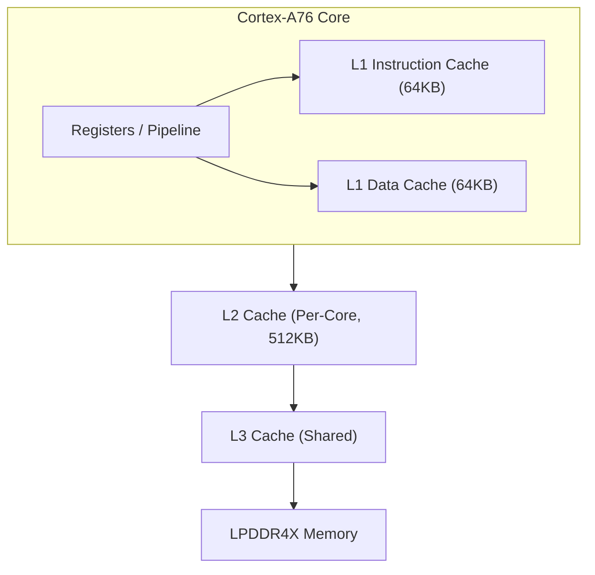
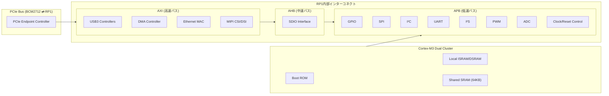
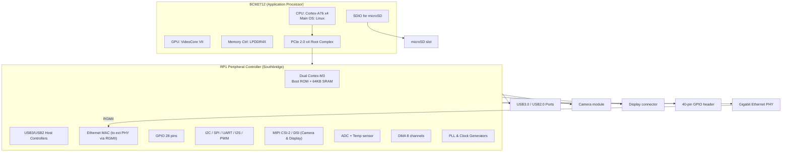
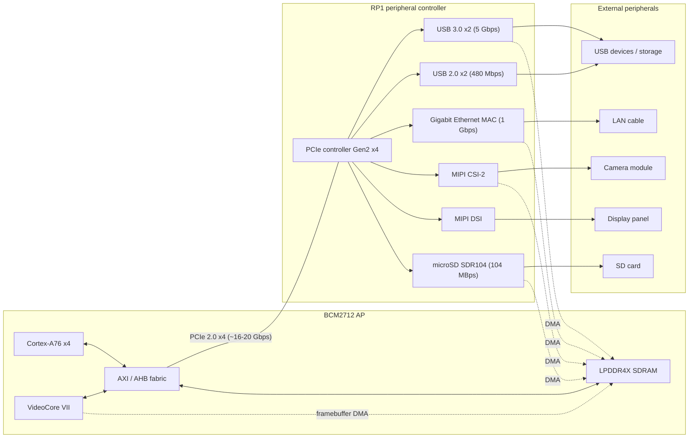
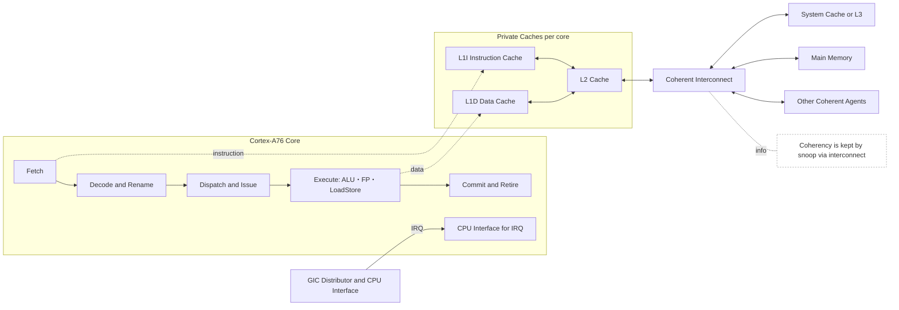

Toplevel

```mermaid
graph TD
    AP["BCM2712 (AP / 4x Cortex-A76)"]
    MEM["LPDDR4X SDRAM"]
    GPU["VideoCore VII GPU"]
    HDMI["HDMI 0/1 Output"]
    NVMe["NVMe (PCIe M.2)"]
    RP1["RP1 Peripheral Controller"]
    USB["USB 3.0 / 2.0 Ports"]
    ETH["Gigabit Ethernet"]
    MIPI["MIPI CSI / DSI"]
    GPIO["GPIO Header (SPI / I2C / UART / PWM / ADC)"]
    USD["microSD (SDIO)"]

    AP --> MEM
    AP --> GPU
    GPU --> HDMI
    AP --> NVMe
    AP -- "PCIe 2.0 x1" --> RP1
    RP1 --> USB
    RP1 --> ETH
    RP1 --> MIPI
    RP1 --> GPIO
    RP1 --> USD
```

RP1 Block Dig

```mermaid
graph TD
    PCIeEP["PCIe Endpoint Controller"]
    BUS["Internal Interconnect / Bus"]
    USB3["USB3 Controllers"]
    ETHMAC["Ethernet MAC"]
    MIPI2["MIPI CSI / DSI"]
    SDIO["SDIO Interface"]
    GPIO2["GPIO"]
    SPI2["SPI"]
    I2C2["I2C"]
    UART2["UART"]
    PWM2["PWM"]
    ADC2["ADC"]
    DMA["DMA Controller"]
    SSRAM["Shared SRAM (64KB)"]
    LSRAM["Local SRAM"]
    BOOT["Boot ROM"]
    CLK["Clock / Reset Control"]

    PCIeEP --> BUS
    BUS --> USB3
    BUS --> ETHMAC
    BUS --> MIPI2
    BUS --> SDIO
    BUS --> GPIO2
    BUS --> SPI2
    BUS --> I2C2
    BUS --> UART2
    BUS --> PWM2
    BUS --> ADC2
    BUS --> DMA
    DMA --> SSRAM
    DMA --> LSRAM
    BOOT --> BUS
    CLK --> BUS


```

Internal AP

```mermaid
flowchart TB
  subgraph CLUSTER["BCM2712 Core Cluster"]
    C0["Cortex-A76 Core 0\nL1I + L1D"] --> L2_0["L2 (Private)"]
    C1["Cortex-A76 Core 1\nL1I + L1D"] --> L2_1["L2 (Private)"]
    C2["Cortex-A76 Core 2\nL1I + L1D"] --> L2_2["L2 (Private)"]
    C3["Cortex-A76 Core 3\nL1I + L1D"] --> L2_3["L2 (Private)"]
  end

  L3S["L3 (Shared)"]
  FAB["System Fabric (AXI / NoC)"]
  MEMC["LPDDR4X Memory Controller"]
  RAM["LPDDR4X SDRAM"]
  VCGPU["VideoCore VII GPU"]
  DISP["Display Controller"]
  PCIE["PCIe 2.0 Controller"]

  L2_0 --> L3S
  L2_1 --> L3S
  L2_2 --> L3S
  L2_3 --> L3S

  L3S --> FAB
  VCGPU --> FAB
  PCIE --> FAB
  FAB --> MEMC
  MEMC --> RAM
  VCGPU --> DISP
```

Internal A-core

```mermaid
flowchart TB
  subgraph Core["Cortex-A76 Core"]
    L1I["L1 Instruction Cache (64KB)"]
    L1D["L1 Data Cache (64KB)"]
    REG["Registers / Pipeline"]
    REG --> L1I
    REG --> L1D
  end

  L2["L2 Cache (Per-Core, 512KB)"]
  L3["L3 Cache (Shared)"]
  MEM["LPDDR4X Memory"]

  Core --> L2
  L2 --> L3
  L3 --> MEM
```

```mermaid
flowchart LR
    subgraph PCIeBus["PCIe Bus (BCM2712 ⇄ RP1)"]
        PCIe_EP["PCIe Endpoint Controller"]
    end

    subgraph RP1_Interconnect["RP1内部インターコネクト"]
        direction TB
        subgraph AXI["AXI (高速バス)"]
            USB3["USB3 Controllers"]
            DMA["DMA Controller"]
            ETH["Ethernet MAC"]
            MIPI["MIPI CSI/DSI"]
        end
        subgraph AHB["AHB (中速バス)"]
            SDIO["SDIO Interface"]
        end
        subgraph APB["APB (低速バス)"]
            GPIO["GPIO"]
            SPI["SPI"]
            I2C["I²C"]
            UART["UART"]
            I2S["I²S"]
            PWM["PWM"]
            ADC["ADC"]
            CLKS["Clock/Reset Control"]
        end
    end

    subgraph CTRL["Cortex-M3 Dual Cluster"]
        ROM["Boot ROM"]
        ISRAM["Local ISRAM/DSRAM"]
        SHRAM["Shared SRAM (64KB)"]
    end

    PCIe_EP --> AXI
    AXI --> AHB
    AHB --> APB
    CTRL --> APB
    CTRL --> SHRAM
```

dig2

```mermaid
flowchart TB
  subgraph AP["BCM2712 (Application Processor)"]
    A76["CPU: Cortex-A76 x4\nMain OS: Linux"]
    GPU["GPU: VideoCore VII"]
    MEM["Memory Ctrl: LPDDR4X"]
    RC["PCIe 2.0 x4 Root Complex"]
    SDIO["SDIO for microSD"]
  end

  subgraph RP1["RP1 Peripheral Controller (Southbridge)"]
    M3["Dual Cortex-M3\nBoot ROM + 64KB SRAM"]
    USB["USB3/USB2 Host Controllers"]
    ETH["Ethernet MAC (to ext PHY via RGMII)"]
    GPIO["GPIO 28 pins"]
    LSIO["I2C / SPI / UART / I2S / PWM"]
    MIPI["MIPI CSI-2 / DSI (Camera & Display)"]
    ADC["ADC + Temp sensor"]
    DMA["DMA 8 channels"]
    PLL["PLL & Clock Generators"]
  end

  STORAGE["microSD slot"]
  PHY["Gigabit Ethernet PHY"]
  USBP["USB3.0 / USB2.0 Ports"]
  CAM["Camera module"]
  DISP["Display connector"]
  GPIOHDR["40-pin GPIO header"]

  %% Connections
  A76 --> RC
  RC --> RP1
  SDIO --> STORAGE
  RP1 --> USBP
  RP1 --> PHY
  RP1 --> GPIOHDR
  RP1 --> CAM
  RP1 --> DISP
  PHY -->|RGMII| ETH
```

④ 通信系統図（データフロー／バス構造図）

```mermaid
flowchart LR;
subgraph AP["BCM2712 AP"];
CPU1["Cortex-A76 x4"];
GPU1["VideoCore VII"];
MEM1["LPDDR4X SDRAM"];
AXI1["AXI / AHB fabric"];
end;

subgraph RP1["RP1 peripheral controller"];
PCIE1["PCIe controller Gen2 x4"];
USB3H["USB 3.0 x2 (5 Gbps)"];
USB2H["USB 2.0 x2 (480 Mbps)"];
ETH1["Gigabit Ethernet MAC (1 Gbps)"];
CSI1["MIPI CSI-2"];
DSI1["MIPI DSI"];
SDIO1["microSD SDR104 (104 MBps)"];
end;

subgraph EXT["External peripherals"];
CAM["Camera module"];
DISP["Display panel"];
USBDEV["USB devices / storage"];
LAN["LAN cable"];
SDC["SD card"];
end;

CPU1<-->AXI1;
GPU1<-->AXI1;
MEM1<-->AXI1;

AXI1-- "PCIe 2.0 x4 (~16-20 Gbps)" ---PCIE1;

PCIE1-->USB3H;
PCIE1-->USB2H;
PCIE1-->ETH1;
PCIE1-->CSI1;
PCIE1-->DSI1;
PCIE1-->SDIO1;

USB3H-->USBDEV;
USB2H-->USBDEV;
ETH1-->LAN;
CSI1-->CAM;
DSI1-->DISP;
SDIO1-->SDC;

USB3H-. "DMA" .->MEM1;
ETH1-. "DMA" .->MEM1;
SDIO1-. "DMA" .->MEM1;
CSI1-. "DMA" .->MEM1;
GPU1-. "framebuffer DMA" .->MEM1;
```

⑤ コアレベル図（Cortex-A76 / Cortex-M0+ など）

```mermaid
flowchart LR
  %% ===== Cortex-A76: 命令処理とメモリ階層 =====
  subgraph A76["Cortex-A76 Core"]
    F[Fetch]
    D[Decode and Rename]
    IS[Dispatch and Issue]
    EX[Execute: ALU・FP・LoadStore]
    CM[Commit and Retire]
    IRQI[CPU Interface for IRQ]
    F --> D --> IS --> EX --> CM
  end

  subgraph Private["Private Caches per core"]
    L1I[L1I Instruction Cache]
    L1D[L1D Data Cache]
    L2[L2 Cache]
  end

  %% 参照経路（点線）
  F -. instruction .-> L1I
  EX -. data .-> L1D

  %% キャッシュ階層と一貫性
  L1I <--> L2
  L1D <--> L2
  L2 <--> CC[Coherent Interconnect]
  CC <--> SC[System Cache or L3]
  CC <--> MEM[Main Memory]
  CC <--> IO[Other Coherent Agents]

  %% 割り込み経路
  GIC[GIC Distributor and CPU Interface] -->|IRQ| IRQI

  %% 注釈ノード（点線で紐づけ）
  NOTE[Coherency is kept by snoop via interconnect]:::note
  CC -. info .- NOTE

  classDef note fill:#fff,stroke:#999,stroke-dasharray:3 3,color:#333;


```
