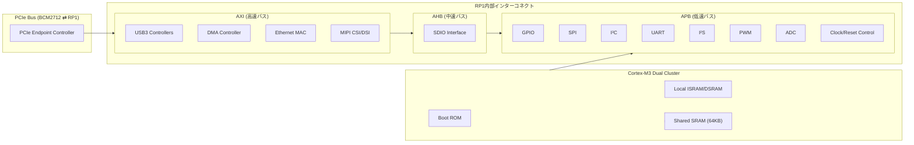

```mermaid
flowchart LR
    subgraph PCIeBus["PCIe Bus (BCM2712 ⇄ RP1)"]
        PCIe_EP["PCIe Endpoint Controller"]
    end

    subgraph RP1_Interconnect["RP1内部インターコネクト"]
        direction TB
        subgraph AXI["AXI (高速バス)"]
            USB3["USB3 Controllers"]
            DMA["DMA Controller"]
            ETH["Ethernet MAC"]
            MIPI["MIPI CSI/DSI"]
        end
        subgraph AHB["AHB (中速バス)"]
            SDIO["SDIO Interface"]
        end
        subgraph APB["APB (低速バス)"]
            GPIO["GPIO"]
            SPI["SPI"]
            I2C["I²C"]
            UART["UART"]
            I2S["I²S"]
            PWM["PWM"]
            ADC["ADC"]
            CLKS["Clock/Reset Control"]
        end
    end

    subgraph CTRL["Cortex-M3 Dual Cluster"]
        ROM["Boot ROM"]
        ISRAM["Local ISRAM/DSRAM"]
        SHRAM["Shared SRAM (64KB)"]
    end

    PCIe_EP --> AXI
    AXI --> AHB
    AHB --> APB
    CTRL --> APB
    CTRL --> SHRAM
```
