システム全体図

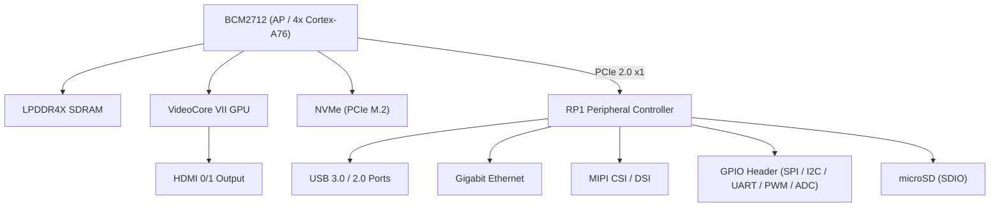

RP1内部ブロック図
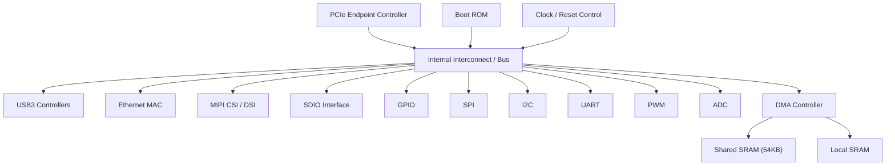

AP(BCM2712)内部ブロック図

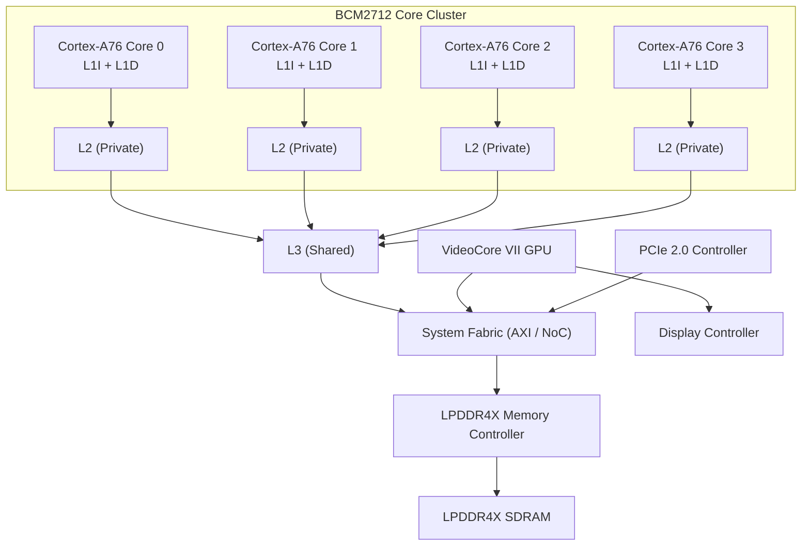

AP(BCM2712)内部ブロック図
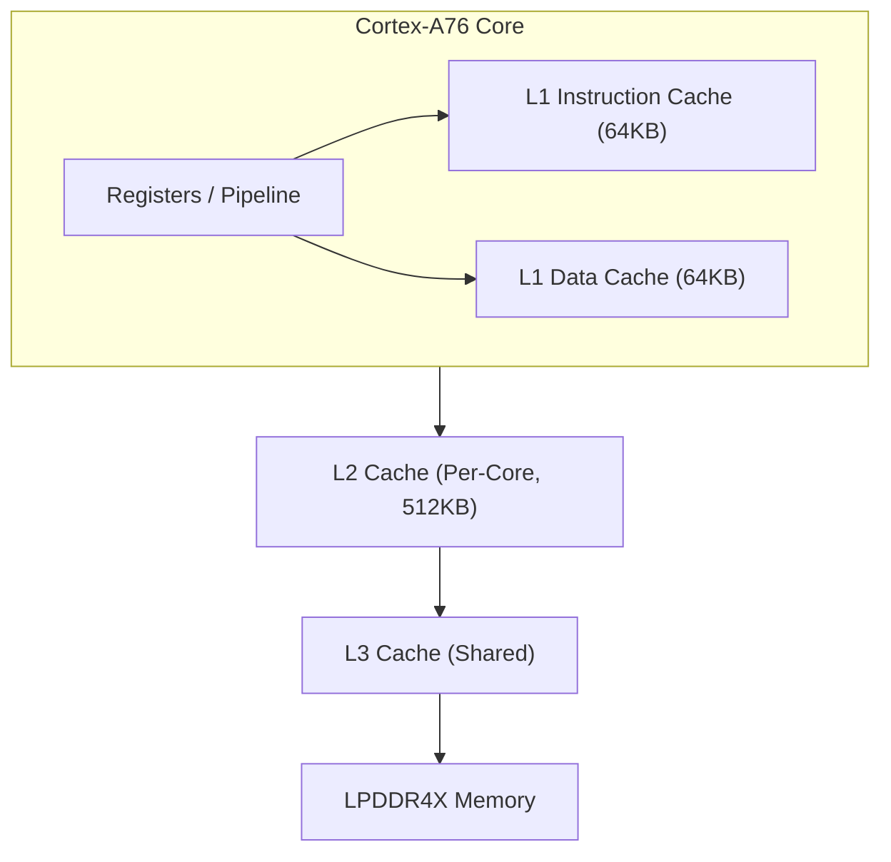

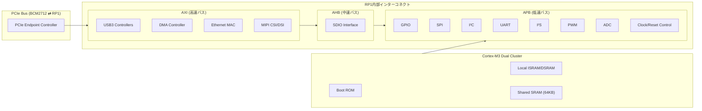

dig2

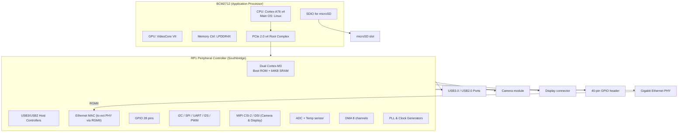

④ 通信系統図（データフロー／バス構造図）
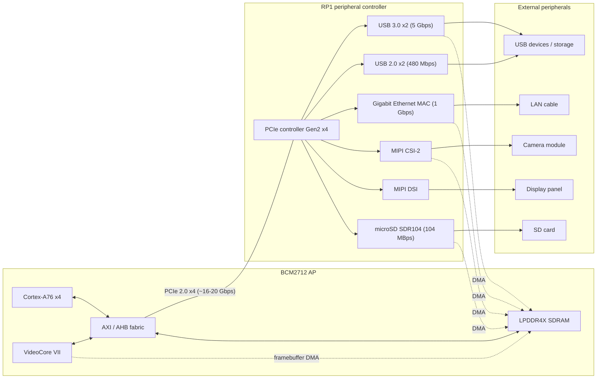

⑤ コアレベル図（Cortex-A76 / Cortex-M0+ など）  
Cortex-A76 パイプラインとキャッシュ階層
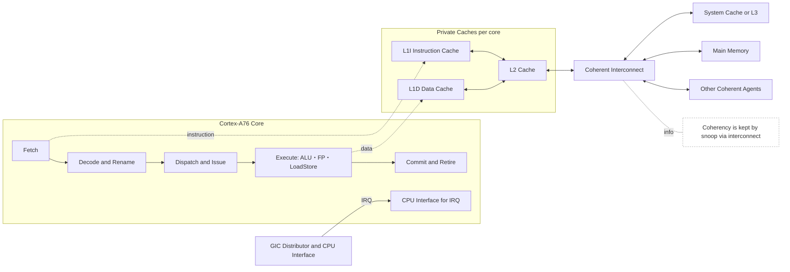
Aコア × Mコア 役割分担と通信

⑥ 電源・クロック・リセット構成図（Power/Clock Tree）汎用
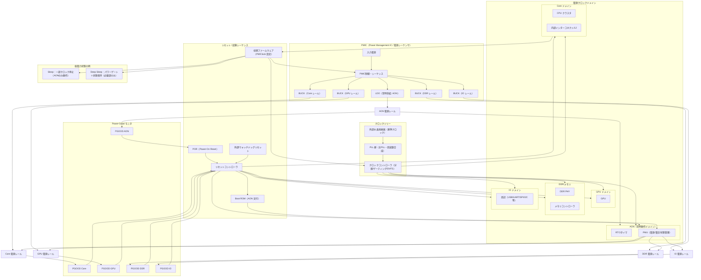

⑥ 電源・クロック・リセット構成図（Power/Clock Tree） RaspberryPi

```mermaid
flowchart TB
  %% =========================
  %% Raspberry Pi 5 Power / Clock / Reset (BCM2712 + RP1)
  %% 目的: 起動順序と電力制御の可視化
  %% 方針: GitHubで崩れにくい表記、HTMLタグ非使用
  %% =========================

  %% ---- PMIC と電源レール ----
  subgraph PMIC[PMIC 電源シーケンサ]
    VIN[入力電源]
    PMIC_CTRL[PMIC 制御]
    LDO_AON[AON 常時電源]
    BUCK_CPU[VDD CPU]
    BUCK_GPU[VDD GPU]
    BUCK_CORE[VDD Core SoC]
    BUCK_DDR[VDD DDR]
    BUCK_IO[VDD IO 1v8 など]
    BUCK_RP1[VDD RP1 3v3 1v8]
    VIN --> PMIC_CTRL
    PMIC_CTRL --> LDO_AON
    PMIC_CTRL --> BUCK_CPU
    PMIC_CTRL --> BUCK_GPU
    PMIC_CTRL --> BUCK_CORE
    PMIC_CTRL --> BUCK_DDR
    PMIC_CTRL --> BUCK_IO
    PMIC_CTRL --> BUCK_RP1
  end

  LDO_AON --> AON_VDD[AON 電源]
  BUCK_CPU --> CPU_VDD[CPU 電源]
  BUCK_GPU --> GPU_VDD[GPU 電源]
  BUCK_CORE --> CORE_VDD[Core 電源]
  BUCK_DDR --> DDR_VDD[DDR 電源]
  BUCK_IO  --> IO_VDD[IO 電源]
  BUCK_RP1 --> RP1_VDD[RP1 電源]

  %% ---- Power Good ----
  subgraph PGOOD[Power Good モニタ]
    PGOOD_AON[PG AON]
    PGOOD_CPU[PG CPU]
    PGOOD_GPU[PG GPU]
    PGOOD_CORE[PG Core]
    PGOOD_DDR[PG DDR]
    PGOOD_IO[PG IO]
    PGOOD_RP1[PG RP1]
  end

  AON_VDD --> PGOOD_AON
  CPU_VDD --> PGOOD_CPU
  GPU_VDD --> PGOOD_GPU
  CORE_VDD --> PGOOD_CORE
  DDR_VDD --> PGOOD_DDR
  IO_VDD  --> PGOOD_IO
  RP1_VDD --> PGOOD_RP1

  %% ---- リセットとブート経路 ----
  subgraph RESET[Reset と Boot 経路]
    POR[Power On Reset]
    EXT_RST[外部やWDTのリセット]
    RST_CTRL[リセットコントローラ]
    BOOTROM[Boot ROM]
    FW[初期FWとブートローダ]
  end

  PGOOD_AON --> POR
  PGOOD_CORE --> POR
  POR --> RST_CTRL
  EXT_RST --> RST_CTRL
  RST_CTRL --> BOOTROM

  %% ---- クロックツリー ----
  subgraph CLOCK[クロックツリー]
    XO[外部基準発振器]
    PLL_ARM[PLL ARM]
    PLL_GPU[PLL GPU]
    PLL_CORE[PLL Core]
    PLL_DDR[PLL DDR]
    CLK_CTRL[クロック分配とゲーティング]
    XO --> PLL_ARM
    XO --> PLL_GPU
    XO --> PLL_CORE
    XO --> PLL_DDR
    PLL_ARM --> CLK_CTRL
    PLL_GPU --> CLK_CTRL
    PLL_CORE --> CLK_CTRL
    PLL_DDR --> CLK_CTRL
  end

  %% ---- SoC と周辺ドメイン ----
  subgraph BCM2712[BCM2712 Application Processor]
    subgraph AON_DOM[AON 常時動作]
      RTC[RTC Timer]
      PMU[SoC 内 PMU]
    end
    subgraph CPU_DOM[CPU ドメイン]
      CPU[A76 CPU Cluster]
      INTERCONNECT[内部インターコネクト]
    end
    subgraph GPU_DOM[GPU ドメイン]
      GPU[VideoCore VII GPU]
    end
    subgraph MEM_DOM[メモリ ドメイン]
      DDR_PHY[DDR PHY]
      MEMC[メモリコントローラ]
    end
    subgraph IO_DOM[SoC 内 IO]
      SIP[セキュア初期化など]
    end
  end

  subgraph RP1[RP1 Peripheral Controller]
    RP1_PLL[RP1 PLL]
    RP1_PERI[USB Ethernet PCIe Bridge 等]
  end

  %% ---- 電源の接続 ----
  AON_VDD --> AON_DOM
  CORE_VDD --> CPU_DOM
  CORE_VDD --> IO_DOM
  GPU_VDD --> GPU_DOM
  DDR_VDD --> MEM_DOM
  RP1_VDD --> RP1

  %% ---- クロック配布 ----
  CLK_CTRL --> AON_DOM
  CLK_CTRL --> CPU_DOM
  CLK_CTRL --> GPU_DOM
  CLK_CTRL --> MEM_DOM
  CLK_CTRL --> IO_DOM
  RP1_PLL --> RP1_PERI

  %% ---- リセット配布 ----
  RST_CTRL --> AON_DOM
  RST_CTRL --> CPU_DOM
  RST_CTRL --> GPU_DOM
  RST_CTRL --> MEM_DOM
  RST_CTRL --> IO_DOM
  RST_CTRL --> RP1

  %% ---- 起動順序と相互作用 ----
  BOOTROM --> PMU
  PMU --> CPU_VDD
  PMU --> DDR_VDD
  PMU --> GPU_VDD
  PMU --> IO_VDD
  PMU --> RP1_VDD

  BOOTROM --> FW
  FW --> CLK_CTRL
  FW --> PMIC_CTRL

  %% ---- PCIe リンク確立で RP1 有効化 ----
  subgraph LINK[RP1 連携]
    PCIE_LINK[PCIe Link Up]
  end
  CPU_DOM --> PCIE_LINK
  PCIE_LINK --> RP1_PERI

  %% ---- 低電力制御例 ----
  subgraph LOWPWR[低電力状態]
    CPU_IDLE[CPU クロックゲート]
    GPU_OFF[GPU ドメイン停止]
    DDR_RET[DDR リテンション]
    SOC_DS[Deep Sleep]
  end
  FW --> CPU_IDLE
  FW --> GPU_OFF
  FW --> DDR_RET
  FW --> SOC_DS

```
⑦ メモリマップ／アドレス空間図  
AP（BCM2712）から見たメモリマップ（概要）
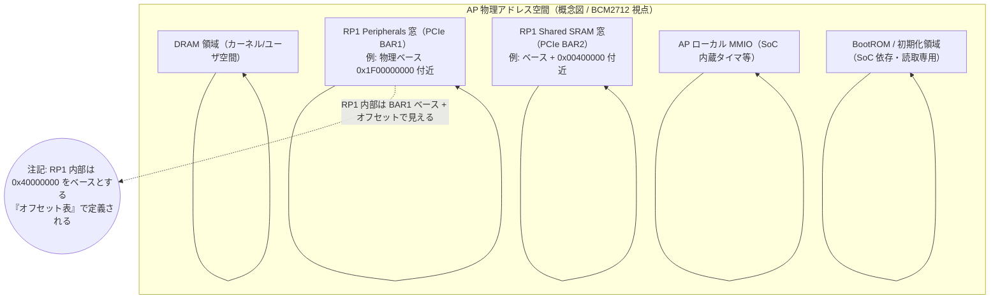

RP1 ペリフェラルのオフセット（Device Tree の reg に対応）
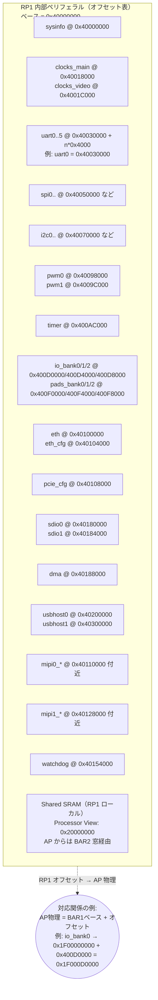
