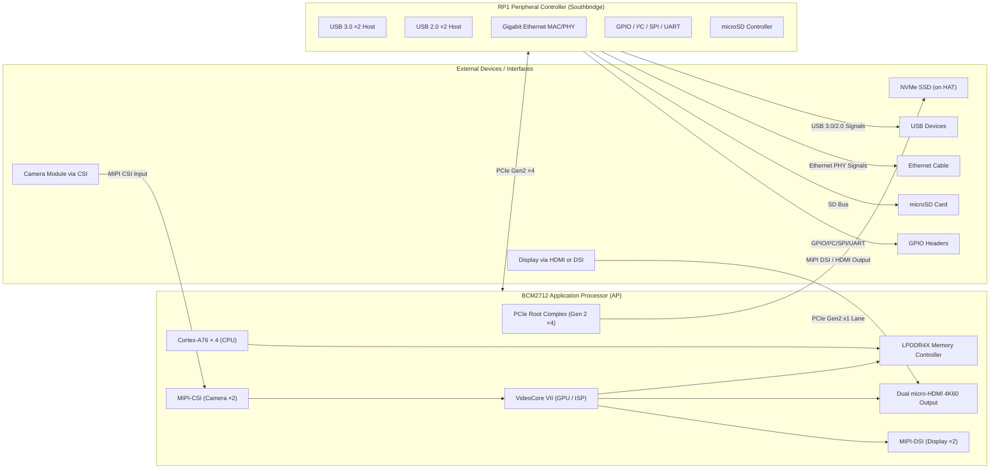

```mermaid
flowchart LR
    %% Cluster definitions
    subgraph AP["BCM2712 Application Processor (AP)"]
        CPU["Cortex-A76 × 4 (CPU)"]
        GPU["VideoCore VII (GPU / ISP)"]
        DDR["LPDDR4X Memory Controller"]
        PCIeCtrl["PCIe Root Complex (Gen 2 ×4)"]
        HDMI["Dual micro-HDMI 4K60 Output"]
        DSI["MIPI-DSI (Display ×2)"]
        CSI["MIPI-CSI (Camera ×2)"]
    end

    subgraph RP1["RP1 Peripheral Controller (Southbridge)"]
        USB3["USB 3.0 ×2 Host"]
        USB2["USB 2.0 ×2 Host"]
        ETH["Gigabit Ethernet MAC/PHY"]
        GPIO["GPIO / I²C / SPI / UART"]
        SD["microSD Controller"]
    end

    subgraph EXT["External Devices / Interfaces"]
        NVMe["NVMe SSD (on HAT)"]
        USBDev["USB Devices"]
        ETHConn["Ethernet Cable"]
        Display["Display via HDMI or DSI"]
        Camera["Camera Module via CSI"]
        SDCard["microSD Card"]
        GPIOPins["GPIO Headers"]
    end

    %% Main inter-chip connection
    AP <--> |"PCIe Gen2 ×4"| RP1

    %% Internal AP links
    CPU --> DDR
    GPU --> DDR
    GPU --> HDMI
    GPU --> DSI
    CSI --> GPU
    Camera --> |"MIPI CSI Input"| CSI
    Display --> |"MIPI DSI / HDMI Output"| HDMI

    %% Storage / Peripheral paths
    PCIeCtrl --> |"PCIe Gen2 x1 Lane"| NVMe
    RP1 --> |"USB 3.0/2.0 Signals"| USBDev
    RP1 --> |"Ethernet PHY Signals"| ETHConn
    RP1 --> |"SD Bus"| SDCard
    RP1 --> |"GPIO/I²C/SPI/UART"| GPIOPins
```
