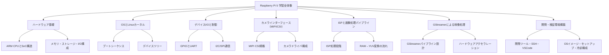

# Raspberry Pi 5 で学ぶ ARM・Linux・ISP 学習要領  
**Ver. 1.0 / Author: Kentarou Takaki**

---

## 🧭 第0章：全体像と学習構造

このドキュメントは、Raspberry Pi 5 を題材に **ARMアーキテクチャ・Linuxカーネル・カメラインターフェース（MIPI/ISP）・GStreamer** の要素を段階的に理解するための「学習実施ノート」です。  
各章は「理解→実践→記録」のサイクルで構成され、完了チェックボックスを付けて進められる形式です。

---

### 🎯 学習対象の全体構造（階層図）

---

## 📘 第1章：Raspberry Pi 5 のハードウェア全体像

### 対象コンポーネント
- 上記ツリー中の **B（ハードウェア基礎）** に対応

### 学習レベル感
- **理解レベル：構造を説明できる**
- **実践レベル：主要ブロック図を自作できる**

### 学習完了時の期待状態
> - SoC（System-on-Chip）構造の概要を理解し、CPU、GPU、メモリ、ペリフェラルの関係を説明できる。  
> - Pi 5 における VideoCore VII GPU、MIPI/DSI/CSI の位置付けを理解している。  
> - 拡張端子（GPIO、USB、HDMI、microSD）を用途別に説明できる。

---

#### ✅ 実施チェックラン

- [ ] Raspberry Pi 5 の主要構成要素を図示した。  
- [ ] SoCとペリフェラルの役割分担を説明できる。  
- [ ] micro HDMI 出力の仕様（4K60対応×2）を理解した。  
- [ ] microSDカード・電源仕様（5V/5A）を確認した。  
- [ ] NVMe HATやUSB3.0拡張の接続構成を確認した。

---

## 📗 第2章：OSとカーネルの起動プロセス

### 対象コンポーネント
- ツリー中の **C（OSとLinuxカーネル）**

### 学習レベル感
- **理解レベル：ブートプロセスの流れを説明できる**
- **実践レベル：デバイスツリーを読んでCPU構成を確認できる**

### 学習完了時の期待状態
> - Piの電源ONからカーネル起動までの流れ（bootloader → firmware → kernel）を把握。  
> - Device Tree（`.dtb`）構成と、ペリフェラル登録の仕組みを理解。  
> - Raspberry Pi OS上で `dmesg` / `/proc/device-tree` の解析ができる。

---

#### ✅ 実施チェックラン

- [ ] ブートローダとカーネルの役割を説明できる。  
- [ ] Device Treeの構造を確認した（例：`cat /proc/device-tree/model`）。  
- [ ] Kernelログでカメラデバイスの登録状況を確認した。  
- [ ] OSブート時のファイル階層（/boot, /lib/modules, /proc）を理解した。  

---

## 📙 第3章：デバイスI/Oと制御

### 対象コンポーネント
- ツリー中の **D（デバイスI/Oと制御）**

### 学習レベル感
- **理解レベル：GPIO・UART・I2Cの仕組みを理解**
- **実践レベル：GPIO制御・UART通信を実験できる**

### 学習完了時の期待状態
> - GPIOピンを入力／出力制御できる。  
> - UART/I2C通信の概要を理解し、デバイス接続を試せる。  
> - ピンアサインの重要性（マルチプレクス）を理解している。

---

#### ✅ 実施チェックラン

- [ ] GPIOをPythonまたはCで制御してLED点灯を確認した。  
- [ ] UARTでシリアル通信を試した。  
- [ ] `raspi-gpio get` でピン状態を取得した。  
- [ ] MIPIピンとGPIOピンの違いを整理した。  

---

## 📕 第4章：カメラインターフェース（MIPI/CSI）

### 対象コンポーネント
- ツリー中の **E（カメラインターフェース）**

### 学習レベル感
- **理解レベル：MIPI CSIの信号構造・レーン構成を理解**
- **実践レベル：libcamera + v4l2でカメラ映像を取得できる**

### 学習完了時の期待状態
> - MIPI CSIの構造（クロック＋データレーン）を説明できる。  
> - `libcamera`でMIPIカメラ映像を取得できる。  
> - `/dev/video0` とドライバ層の関係を理解している。

---

#### ✅ 実施チェックラン

- [ ] MIPI CSIの信号レーン数と帯域を整理した。  
- [ ] libcameraでプレビュー映像を取得した。  
- [ ] `v4l2-ctl --list-devices` でデバイスを確認した。  
- [ ] カメラのISP経路を簡易的に図示した。  

---

## 📒 第5章：ISP（Image Signal Processor）理解

### 対象コンポーネント
- ツリー中の **F（ISPと画像処理パイプライン）**

### 学習レベル感
- **理解レベル：ISPの役割（RAW→YUV→JPEG）を理解**
- **実践レベル：GStreamerでISP経由のパイプラインを実験**

### 学習完了時の期待状態
> - ISP処理の流れ（デマッピング、ノイズ除去、色補正）を説明できる。  
> - Pi 5のISPがGPU側で動作していることを理解。  
> - GStreamerでハードウェアデコード／エンコードを実行できる。

---

#### ✅ 実施チェックラン

- [ ] RAWデータとYUVデータの違いを整理した。  
- [ ] GStreamerで `v4l2src` → `kmssink` のパイプラインを実行した。  
- [ ] H.264/H.265 ハードウェアエンコードのテストを行った。  
- [ ] ISPパスの内部構造を概略図で整理した。  

---

## 📔 第6章：開発・検証環境構築

### 対象コンポーネント
- ツリー中の **H（開発・検証環境）**

### 学習レベル感
- **理解レベル：セットアップ全体を説明できる**
- **実践レベル：ヘッドレス開発環境を整備できる**

### 学習完了時の期待状態
> - Raspberry Pi ImagerでOS書込みから起動まで自力で実施できる。  
> - SSH／VSCode Remote接続で開発できる。  
> - 冷却・電源・SD/SSD構成を安定稼働させられる。

---

#### ✅ 実施チェックラン

- [ ] Raspberry Pi ImagerでA2カードにOSを書き込んだ。  
- [ ] Wi-Fi・SSHを設定しヘッドレス起動した。  
- [ ] VSCode Remote SSHで接続確認。  
- [ ] ファン・ヒートシンク温度を `vcgencmd measure_temp` で確認。  
- [ ] micro HDMIケーブルで映像出力を確認。  

---

## 🧾 Appendix：推奨ハードウェアリスト

| 種別 | 推奨品 | 備考 |
|------|---------|------|
| 本体 | Raspberry Pi 5 (16GB) | 最上位モデル |
| 電源 | 5V/5A（27W）USB-C | 安定動作必須 |
| ストレージ | microSD A2/V30/U3（256GB以上） | OS・データ領域 |
| カメラ | Raspberry Pi Camera Module 3 | MIPI CSI2対応 |
| 冷却 | PWMファン＋アルミヒートシンク | 高発熱対策 |
| ケース | 金属ケース＋エアフロー型 | 放熱性能重視 |
| ケーブル | micro HDMI → HDMI (4K60対応) ×2 | デュアル出力対応 |

---

## 🏁 今後の展開
- カーネルモジュールビルドやISPパラメータ解析へ拡張  
- Pi 5 + i.MX93など他SoCとの比較実験  
- 学習記録を GitHub Issues / Projects でトラッキング化

---

> 💬 このドキュメントは **「理解を形にする」チェックノート** として運用してください。  
> 実験結果・コード断片・メモは各章末に追記して構いません。

